### **V0 Prototype Screenshots**
This prototype was created to validate the user stories and identify any missing requirements. As an early design, it also serves as a guide to define the user journey throughout the application.

<table>
  <tr>
    <td align="center">
      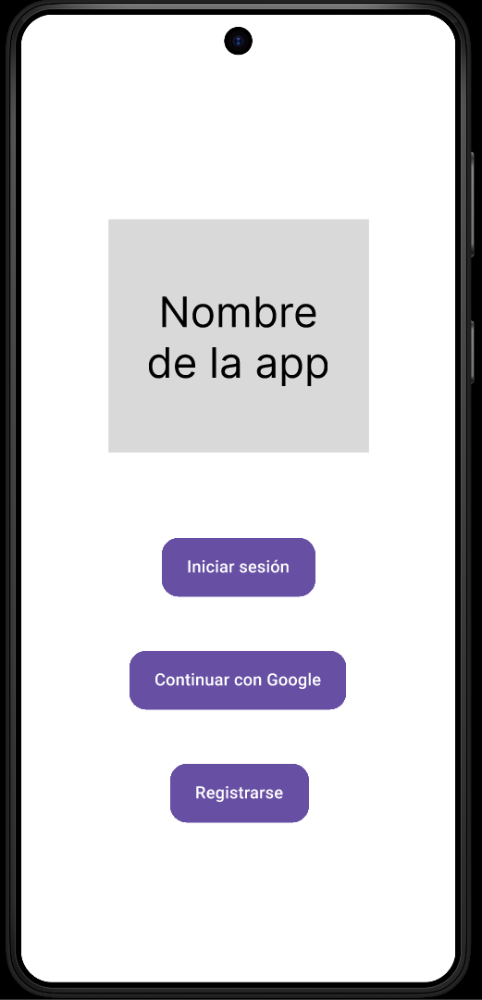 
      Home Screen
    </td>
    <td align="center">
      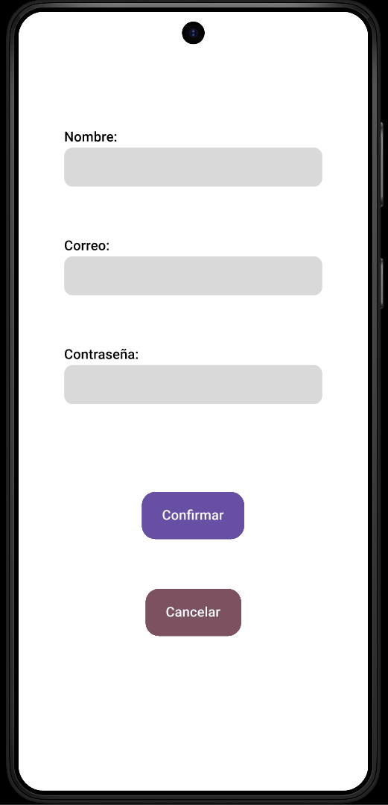 
      Login screen
    </td>
    <td align="center">
      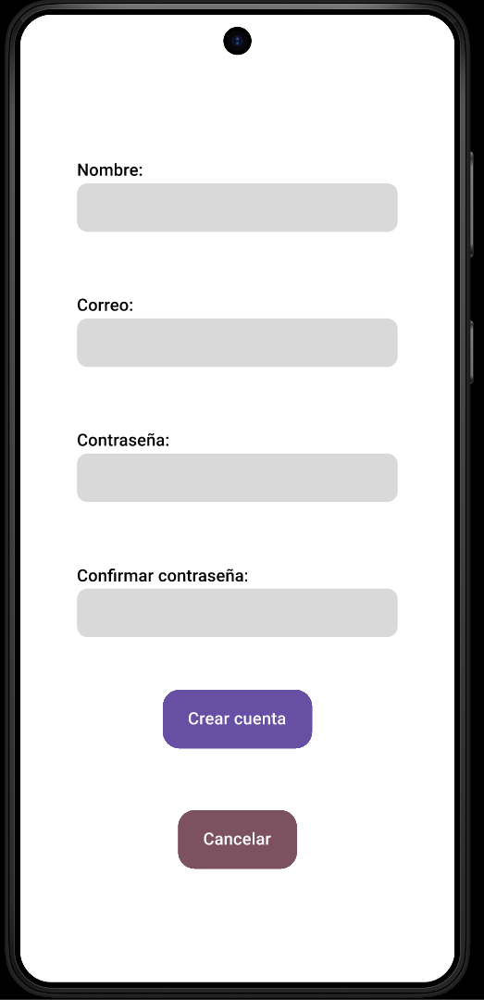 
      Sign up screen
    </td>
  </tr>
  <tr height="20px"></tr>
  <tr>
    <td align="center">
      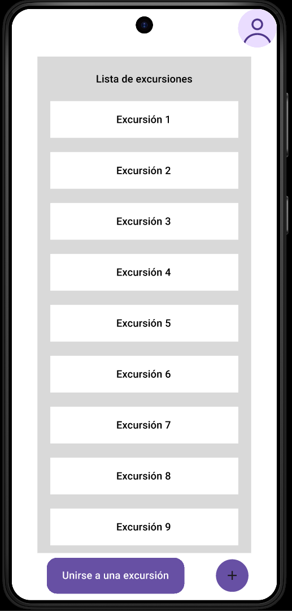 
      Main screen
    </td>
    <td align="center">
      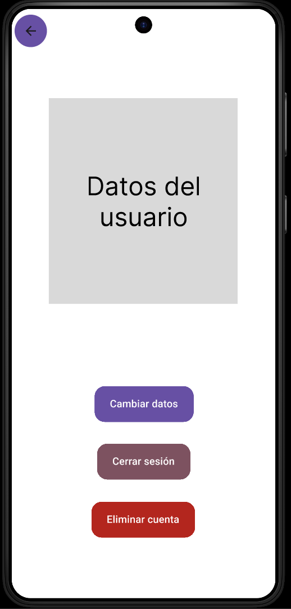 
      Profile screen
    </td>
    <td align="center">
      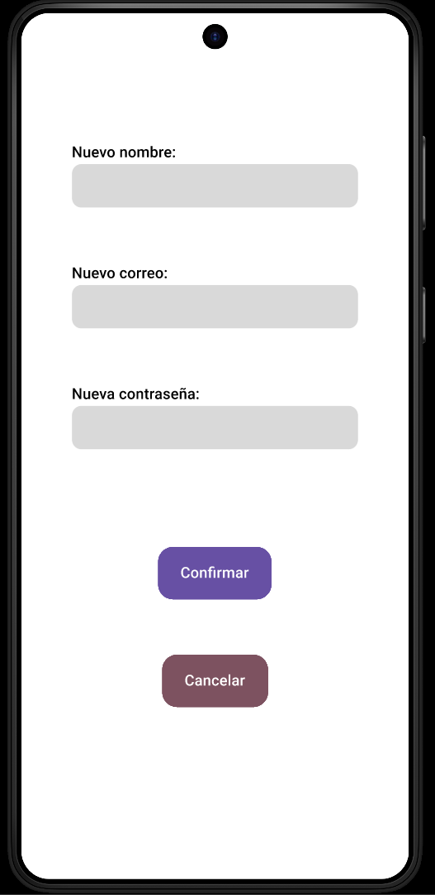 
      Edit profile screen
    </td>
  </tr>
  <tr height="20px"></tr>
  <tr>
    <td align="center">
      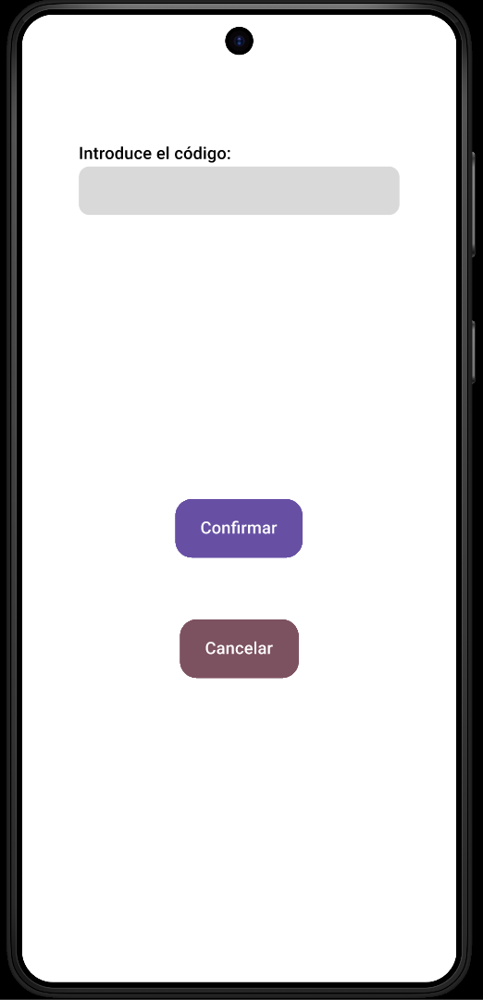 
      Excursion code screen
    </td>
    <td align="center">
      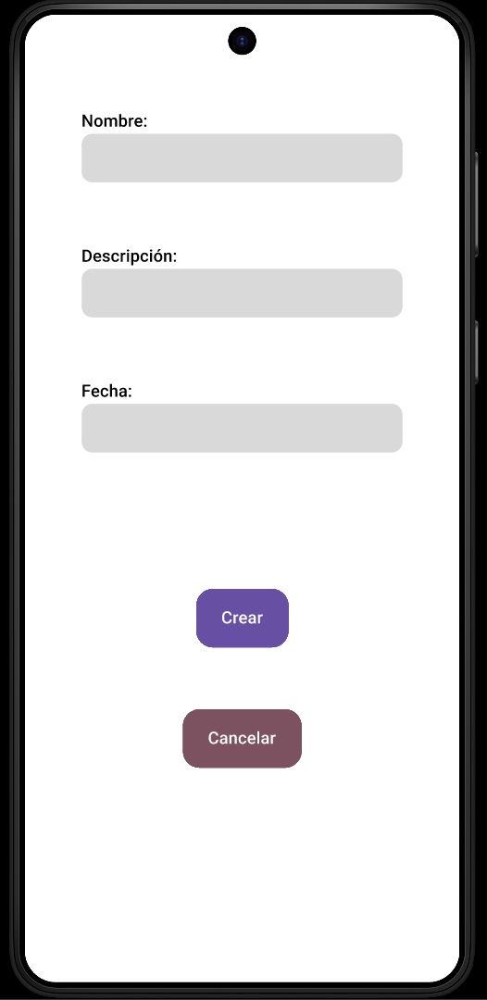 
      Excursion form screen
    </td>
    <td align="center">
      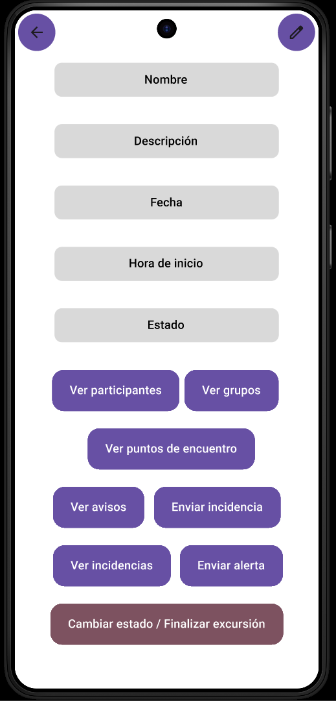 
      Excursion details screen
    </td>
  </tr>
  <tr height="20px"></tr>
  <tr>
    <td align="center">
      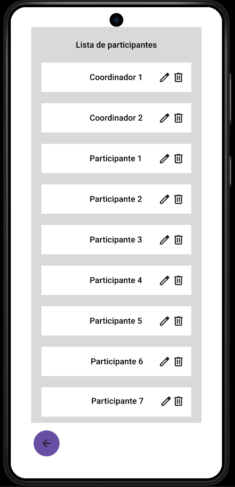 
      Participants screen
    </td>
    <td align="center">
      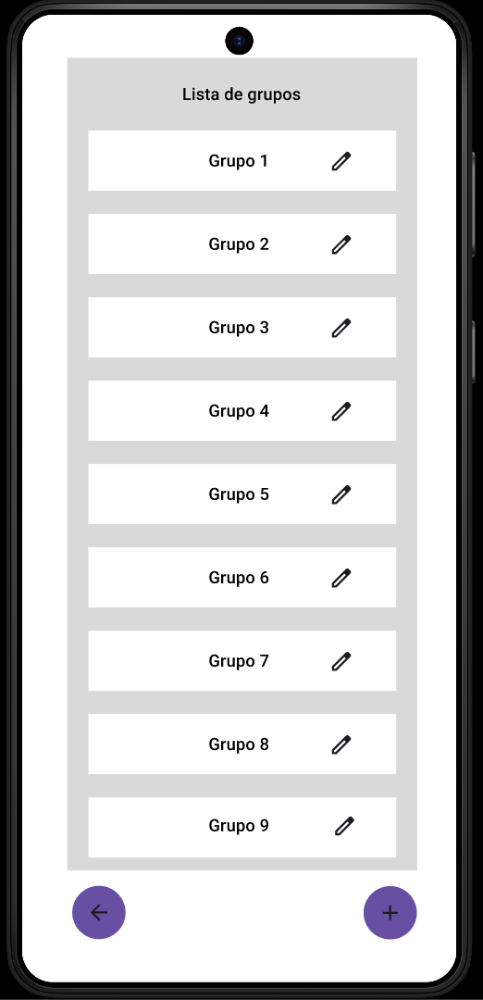 
      Groups screen
    </td>
    <td align="center">
      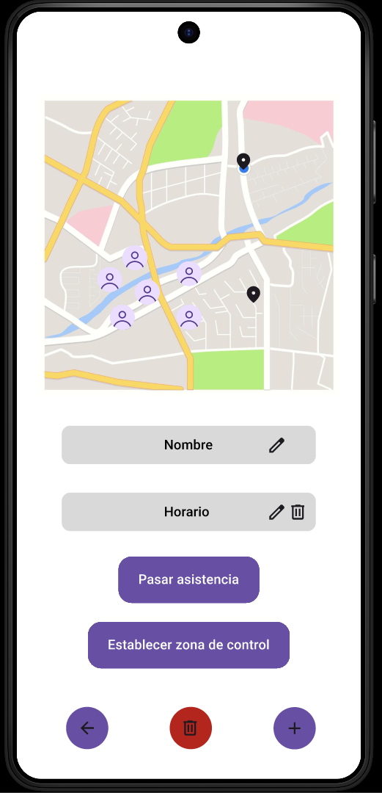 
      Map screen
    </td>
  </tr>
  <tr height="20px"></tr>
  <tr>
    <td align="center">
      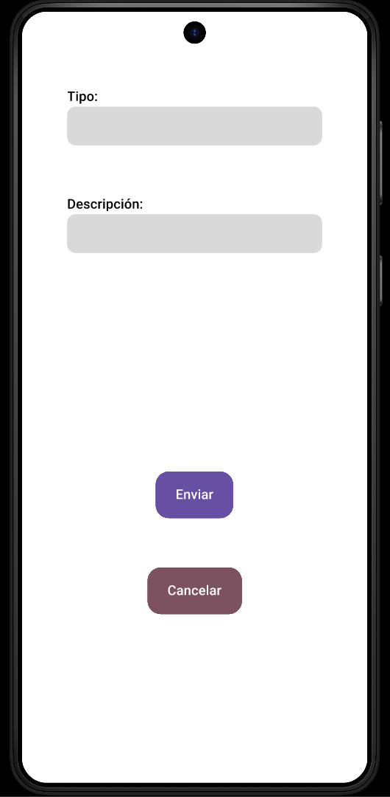 
      Issue form screen
    </td>
    <td align="center">
      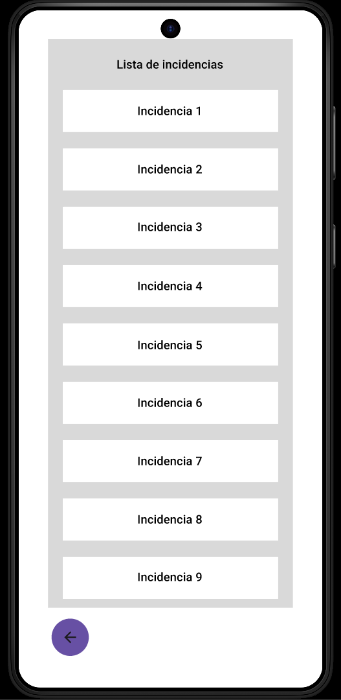 
      Issue screen
    </td>
    <td align="center">
      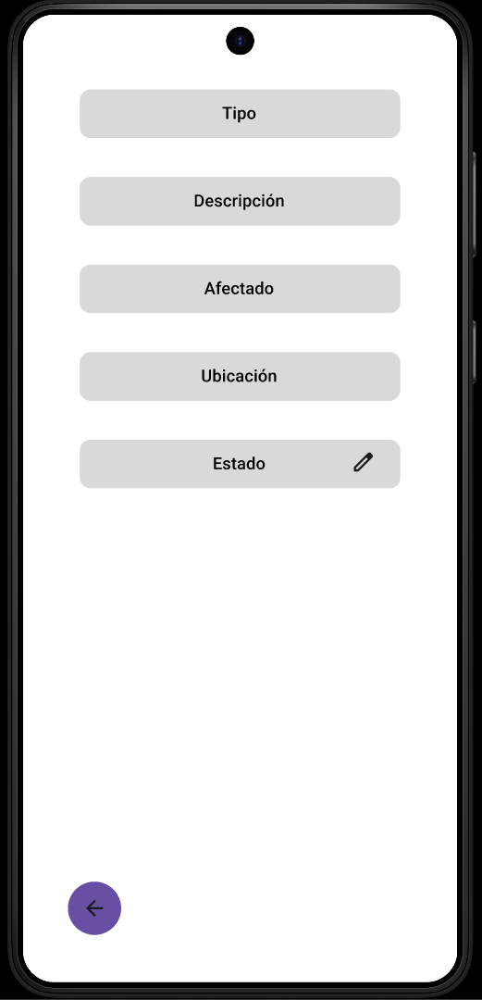 
      Issue details screen
    </td>
  </tr>
  <tr height="20px"></tr>
  <tr>
    <td align="center">
      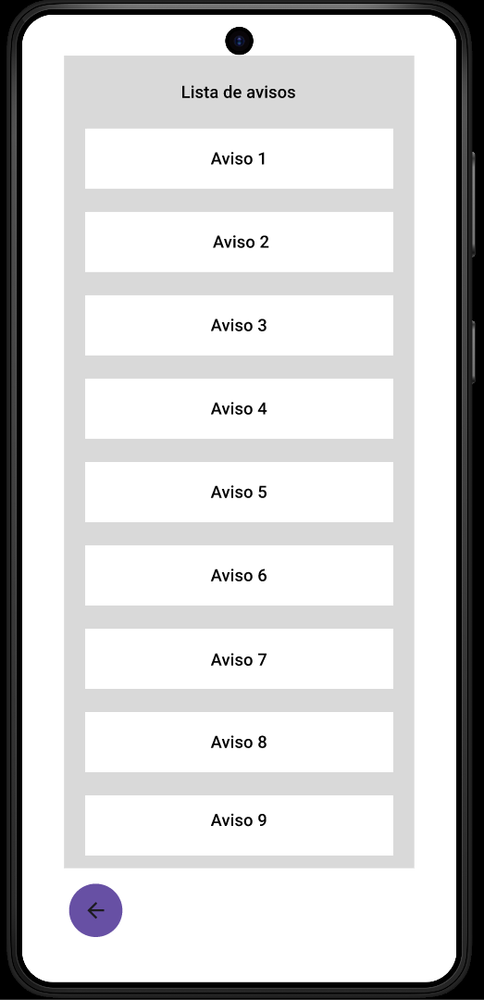 
      Notification screen
    </td>
    <td align="center">
      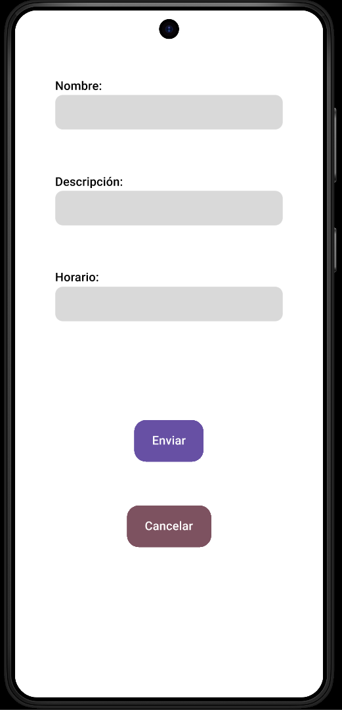 
      Notification form screen
    </td>
    <td align="center">
      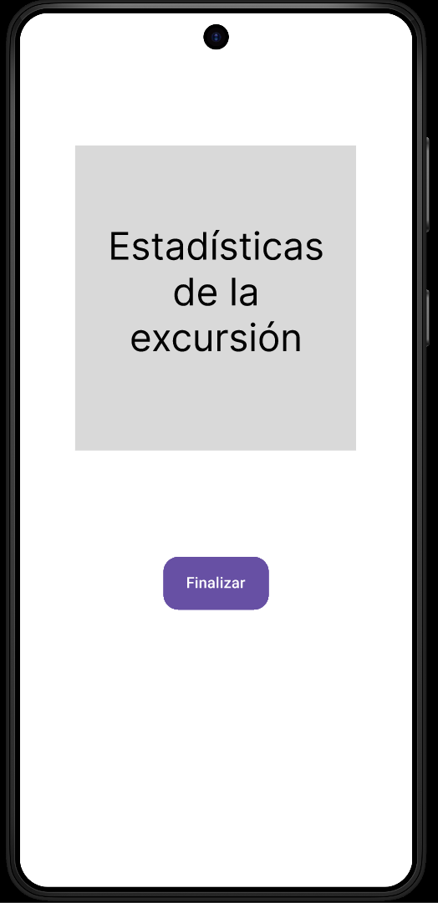 
      Statistics screen
    </td>
  </tr>
</table>

### **V0 Prototype Use Cases**

